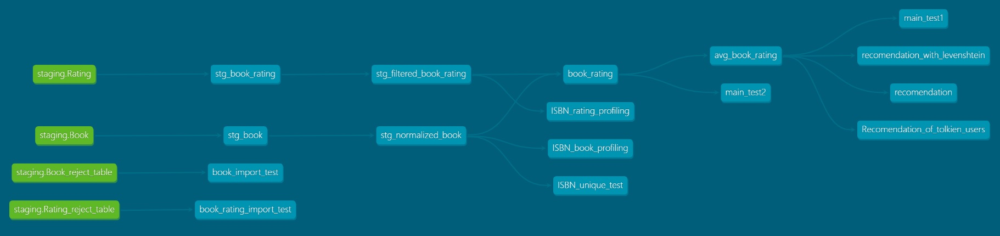

# Řešení

[Dokumentace vytvořené DBT pipeline](http://book-recommend-dbt-doc.s3-website.eu-north-1.amazonaws.com)

[Evidence BI frontend](http://book-recommend.s3-website.eu-north-1.amazonaws.com)

# Popis řešení

Jedná se o ELT pomocí DBT a DuckDB. 

1. Data jsou stažena pomocí Python skriptu `download_data.py` z S3 úložiště a uložena do lokální DuckDB databáze (`reports/sources/books/book_rating.duckdb`).
2. Nastavení zdrojů dat, jejich parametrů, profil i použitá databáze jsou definovány v souboru `.env`.
3. Součástí je `Makefile`, který obsahuje tři hlavní targets:
    a) `download` – stažení CSV a uložení do databáze  
    b) `dbt-run` – spuštění DBT  
    c) `evidence` – sestavení reportu pomocí Evidence
4. CSV data jsou stažena z S3 bucketu: https://book-recommendation.s3.amazonaws.com/
5. Raw CSV data jsou po stažení uložena do lokální DuckDB databáze ve schématu `staging`.
7. Data jsou následně vyčištěna a deduplikována.
8. Po commitu se spustí GitHub Action workflow, které má následující fáze:
    - `dbt-check` – provede kompilaci DBT projektu, spustí testy a publikuje [dokumentaci DBT pipeline na S3 bucket](http://book-recommend-dbt-doc.s3-website.eu-north-1.amazonaws.com)
    - `evidence-report` – zkompiluje report a nahraje výsledek na [S3 bucket](http://book-recommend.s3-website.eu-north-1.amazonaws.com)

## Jak projekt zprovoznit (testováno na Windows)

Vyžaduje: `git`, `python`, `pip`, `nodejs`, `make`

```bash
git clone https://github.com/RadimBaca/book_recommend
cd book_recommend
python -m venv venv
venv\Scripts\activate
pip install -r requirements.txt
make download
make dbt-run
npm --prefix reports install
npm --prefix reports run sources
npm --prefix reports run dev
```

## Vedlejší poznámky k řešení

Aktuální nasazení bych charakterizoval jako *development*. Produkční nasazení by mohlo běžet plně v cloudu – DBT, DuckDB i Evidence nabízejí čistě cloudové řešení. Produkční nasazení mého řešení je pak už jen otázkou správného nastavení `.env`.

Používám jednotnou konvenci pojmenování – jednotlivé modely a jejich atributy používají jednotné číslování. Atributy mají camelCase zápis, tabulky používají snake_case.

## Výhody použití DBT, SQL a GITu



1. Dokumentace celé pipeline v DBT (viz. obrázek)
2. Verzování a do budoucna transparentní rozšiřování projektu pomocí GITu. Trval bych na tom, aby se dodatečné změny vždy nejprve implementovaly ve vlastní větvi.
3. Testovatelnost celé pipeline (od začátku do konce) v DBT
4. Grafická data lineage, která usnadňuje pochopení celého řešení v DBT. Data pipeline je jasně rozdělena do menších částí (modelů), které na sebe navazují.
5. Deklarativnost SQL zpřehledňuje celé řešení. SQL je klasický nástroj pro práci s daty s jasnými vstupy a výstupy.
